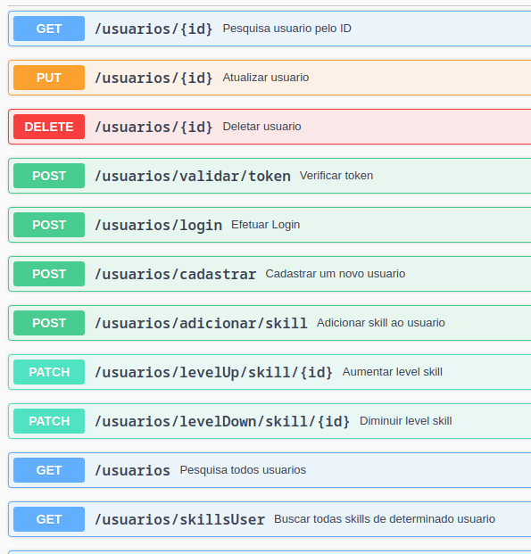

    <h1 style="font-size: 3em">SkillSwap</h1>

# Funcionalidades

### 1. Serviço de Login

- Este serviço recebe login e senha, verifica na base e retorna um token JWT para acesso aos demais serviços.
- A senha é criptografada.

### 2. Serviço de Cadastro

- Este serviço recebe login e senha para cadastrar um novo usuário na base de dados.
- A senha é armazenada de forma criptografada.

### 3. Serviço de Listagem de Skills

- Este serviço recebe o id do usuário e retorna todas as skills associadas a ele, incluindo seus respectivos níveis.

### 4. Serviço de Associar Skill

- Este serviço recebe informações do usuário, da skill e do nível para persistir na base de dados.

### 5. Serviço de Atualizar Associação de Skill

- Este serviço recebe o id da associação da skill e o novo nível para atualização na base de dados.

### 6. Serviço de Excluir Associação de Skill

- Este serviço recebe o id da associação da skill e exclui da base de dados.

## Segurança

- Apenas o Serviço de Login e cadastro é público.
- Os demais serviços requerem autenticação com um token JWT válido.

## Documentação

- Utiliza swagger para gerar documentação automática dos serviços.

